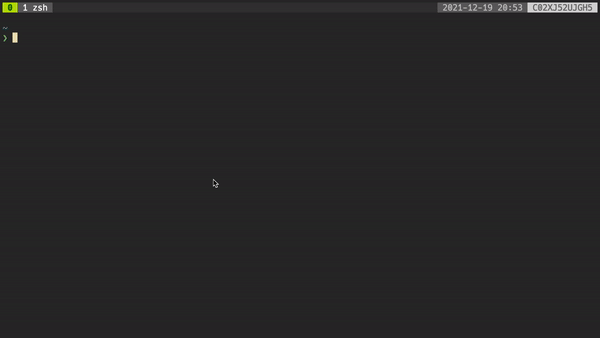

TUI Metronome



# Installation
* `git clone` this repository
* ensure the `go` executable exists on your `$PATH`
* execute `go run .`

# Configuration
## Content
Files which will be used for metronomes ticking. They represent musical songs and their chords, per beat.
An example specification for the classic song made famous by Hank Williams, "Lost Highway".

``` yml
song: LostHighway
 - section:A
  bar:DDDD
  bar:DDGG
  bar:DDDD
  bar:DDDD
  bar:DDDD
  bar:DDGG
  bar:AAAA
  bar:AAAA
 - section:B
  bar:GGGG
  bar:GGGG
  bar:DDDD
  bar:DDDD
  bar:DDDD
  bar:DDAA
  bar:DDDD
  bar:DDDD
```

## Location
Metronome follows the [XDG base dir specification](https://specifications.freedesktop.org/basedir-spec/basedir-spec-latest.html). Store configuration files in `~/.config/metronome/`.
